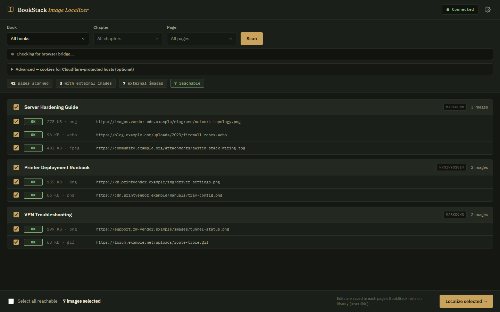
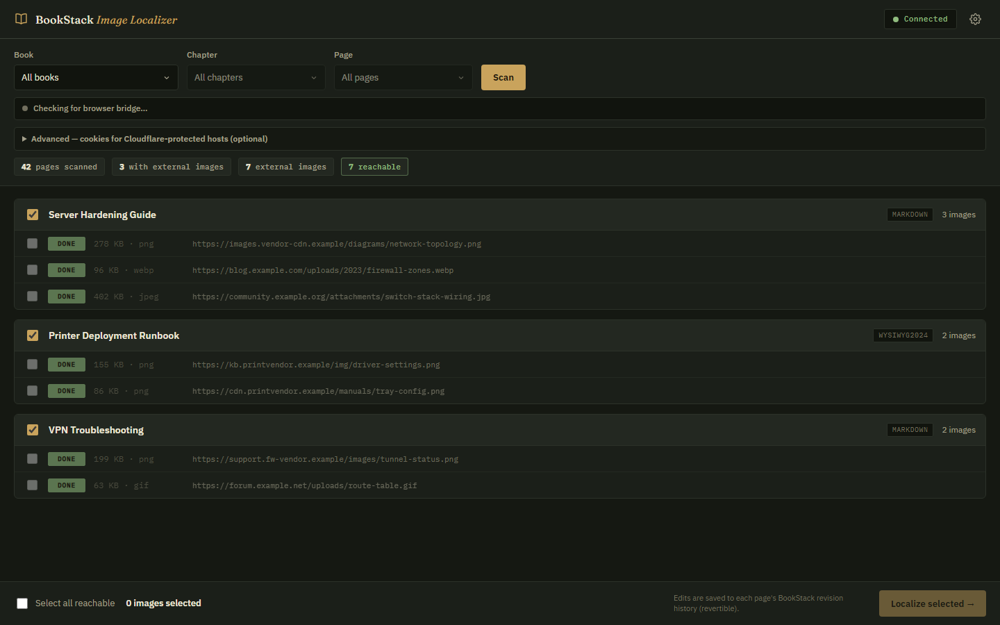
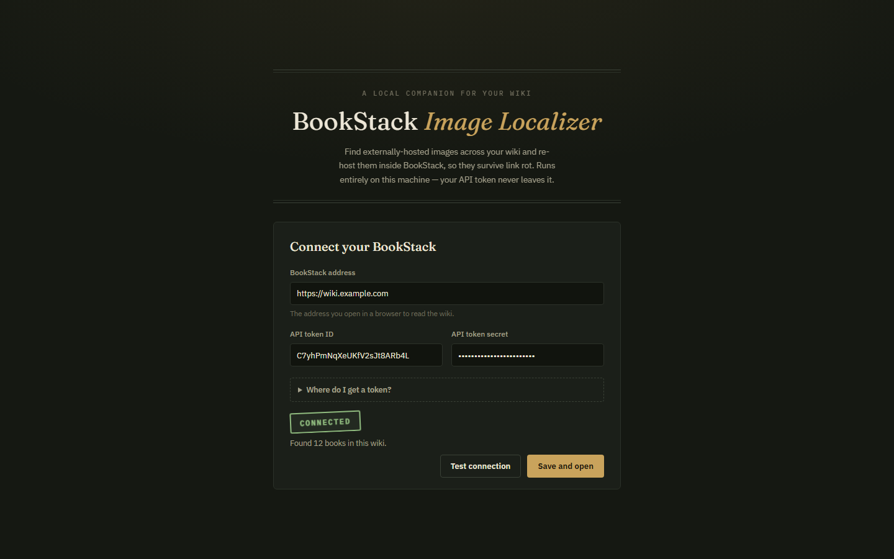

<div align="center">

# 📖 BookStack Image Localizer

**Rescue your wiki's images from link rot.**

A tiny desktop app that finds every externally-hosted image across your
[BookStack](https://www.bookstackapp.com/) wiki and re-hosts it *inside*
BookStack — so your documentation keeps its images even when the internet
moves on.

[](https://github.com/Elite-Cow/bookstack-image-localizer/releases/latest)
[](LICENSE)
[](https://www.bookstackapp.com/)



</div>

---

## Why

Every time someone pastes an image from a blog, a vendor KB, or a forum into
your wiki, that image is only **linked**, not stored. The page looks fine —
until the source site reorganizes, dies, or starts blocking hotlinks. Then your
runbook has a gray broken-image box exactly where the network diagram used to
be, and the original is gone for good.

BookStack Image Localizer closes that gap in three clicks: **scan** your wiki
for externally-hosted images, **review** what it found, and **localize** — each
image is downloaded, uploaded into BookStack's own image gallery, and the page
is rewritten to use the local copy.

## How it works

**1 — Scan (read-only).** Pick a scope — the whole wiki, one book, a chapter,
or a single page — and scan. Every externally-hosted image is listed per page
with its reachability, file size, and type. Scanning never changes anything.

**2 — Review.** Reachable images are pre-selected; anything unreachable is
flagged. Uncheck whatever you want to leave alone.

**3 — Localize.** Each selected image is downloaded, re-hosted in BookStack
attached to its page, and the page content is rewritten to point at the local
copy.

<div align="center">

</div>

### Built to be safe

- **Every page edit lands in BookStack's revision history** — one click in
  BookStack reverts it.
- **Pages are written back in their native format** — Markdown pages stay
  Markdown, WYSIWYG pages stay HTML.
- **A failed download never touches the page.** Content is only rewritten when
  the replacement image is safely stored in BookStack.
- **Fake images are rejected.** Some hosts return login pages instead of
  images; the app checks content types *and* file signatures before storing
  anything.
- **Nothing leaves your machine.** The app runs locally, talks only to your
  BookStack and the image hosts, and stores your API token in your own user
  profile. No telemetry, no cloud, no third-party servers.

## Getting started

### 1. Download and run

Grab the latest release and double-click it:

**[⬇ Download BookStack-Image-Localizer.exe](https://github.com/Elite-Cow/bookstack-image-localizer/releases/latest)**

No installer, no dependencies — the app is a single self-contained executable.
It starts a local server, opens your browser, and walks you through connecting.

> **Windows SmartScreen note:** the executable isn't code-signed, so Windows
> may show "Windows protected your PC." Click **More info → Run anyway**. If
> you'd rather not trust a prebuilt binary, [build it yourself](#building-from-source)
> in two commands.

### 2. Connect your wiki

<div align="center">

</div>

You'll need a BookStack API token:

1. In BookStack, open your profile menu → **My Account** → **Access &
   Security** → in the **API Tokens** section, click **Create Token**.
2. Copy the **Token ID** and **Token Secret** into the setup screen.
3. Your BookStack role needs the **Access System API** permission — ask an
   admin if the API Tokens section is missing.

Hit **Test connection** — a passing test unlocks saving. Settings live in your
user profile and can be changed anytime from the gear icon.

### 3. Scan and localize

Pick a scope, click **Scan**, review, click **Localize selected**. That's the
whole workflow. Re-scan afterwards to confirm the wiki is clean.

## The browser bridge (optional)

Some image hosts (Cloudflare-protected sites, hotlink blockers) refuse
server-side downloads but happily serve *your browser*. For those, the app
offers a small companion **browser extension** — install it from inside the app
(the localizer screen offers it when it's needed) and blocked images are
fetched through your own browser session automatically. Chrome, Edge, and
Firefox are supported.

## FAQ

**Can I undo a localization?**
Yes — every edit is a normal BookStack page revision. Open the page's revision
history in BookStack and revert.

**Does it install anything into my BookStack server?**
No. It's a pure API client. Nothing to install server-side, nothing to break on
BookStack upgrades — it works with any BookStack instance that has the REST API
enabled, including ones where you have no server access at all.

**Is my API token safe?**
The token is stored in a config file in your user profile, on your machine, and
is only ever sent to your BookStack URL. The app binds to `127.0.0.1` — nothing
else on the network can reach it.

**Why is the download ~90 MB?**
It embeds a complete Node.js runtime so there's nothing to install. Trading
disk for zero-setup felt right for a tool you run occasionally.

**What gets detected?**
`` tags in HTML pages and `` images in Markdown pages, on any host
other than your own BookStack. `data:` URIs and relative paths are already
local and are skipped.

## Building from source

Requires [Node.js](https://nodejs.org/) 20.12+.

```bash
npm install
npm start            # run from source → http://localhost:3000
npm run build:app    # package a single executable → dist/
```

The app is dependency-light by design: Express on the server, vanilla JS on the
frontend, no build step for development. `build:app` bundles everything —
code, UI, fonts, the browser-bridge extensions — into one executable using
Node's Single Executable Application support.

## Related

- BookStack feature request for native image importing:
  [bookstack/bookstack#5073](https://codeberg.org/bookstack/bookstack/issues/5073) —
  until something like it ships, this tool fills the gap from the outside.
- [BookStack API docs](https://demo.bookstackapp.com/api/docs)

## License

[MIT](LICENSE) — use it, share it, fork it.

---

<div align="center">
<sub>Not affiliated with the BookStack project — just built with a lot of appreciation for it.</sub>
</div>
